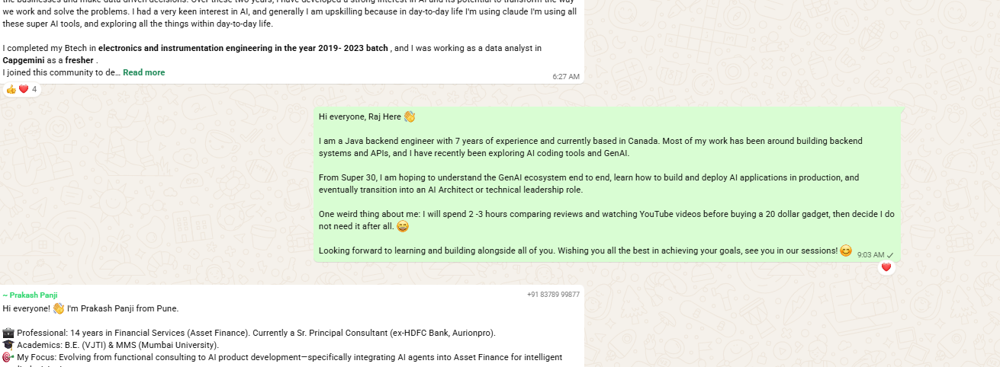

# SP30-GenAI

A collection of assignments, experiments and notes from the Super 30 GenAI programme.

---

## Task 1 — Cohort Slack Introduction

**Date:** 2026-06-20

### Message Posted

> Hi everyone, Raj Here 👋
>
> I am a Java backend engineer with 7 years of experience and currently based in Canada. Most of my work has been around building backend systems and APIs, and I have recently been exploring AI coding tools and GenAI.
>
> From Super 30, I am hoping to understand the GenAI ecosystem end to end, learn how to build and deploy AI applications in production, and eventually transition into an AI Architect or technical leadership role.
>
> One weird thing about me: I will spend 2–3 hours comparing reviews and watching YouTube videos before buying a 20 dollar gadget, then decide I do not need it after all. 😄
>
> Looking forward to learning and building alongside all of you. Wishing you all the best in achieving your goals, see you in our sessions! 😊

### Screenshot Evidence

---

## Evidence Links

| Item | Link |
|---|---|
| This repo | https://github.com/rajvin-cn/SP30-GenAI |
| Screenshot | https://github.com/rajvin-cn/SP30-GenAI/blob/main/evidence/Intro_msg.png |
| Python Setup repo (WL) | https://github.com/rajvin-cn/WL |
